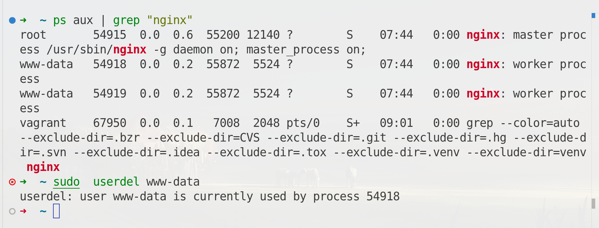

## NOTE FOR WORKING WITH GROUP AND USER

```bash 
sudo useradd names
sudo adduser james # utility commmand 
# create a user with home directory , default login shell as bash shell 
sudo useradd \
    --create-home \
    --shell /bin/bash batman 

# add user to a specific group 
sudo useradd \
    -G sudo \
    --create-home \
    --shell /bin/bash batman 


# login as other user 
sudo su - username # fresh login to username home directory  
sudo su username # change user , keep current working directory 
id # check id of the user  
# to check the default shell of the user 
sudo chsh --shell /bin/bash username 


# delete user 
sudo userdel 
sudo deluser

sudo deluser james
sudo deluser --remove-home superman 
# create zip (.zip, .tar.gz ) 

sudo deluser \
    --backup-to /home/vagrant/backup \
    --remove-home batman

# remove all files that belong to this specific user 
sudo deluser --remove-all-files superman

passwd # change your own password
sudo passwd username # change the password for specific user 

# add normal to sudoer group
sudo usermod -aG sudo superman
```

## Questions
1. will the service stop running if we delete the correspond system user ? 
```bash 
ps aux | grep "nginx"
sudo  userdel www-data
```

