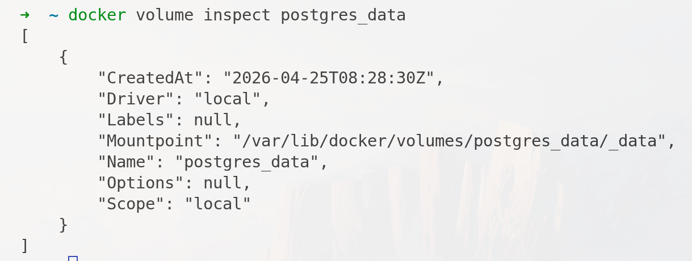

## Using DOcker volume 
### Goal of using the volume 
To shared and store the data between host machine and the containers 

1. Using the `-v` flag 
> Required us to create the docker volume first. 
```bash 
docker volume ls 
docker volume create postgres_data
docker run -dp 5433:5432 \
    --name postgres_cont2 \
    -e POSTGRES_PASSWORD=test123 \
    -v postgres_data:/var/lib/postgresql \
    postgres

# Run the container and populate some data to the database 

# stop and destroy the container 
# run a new container with old volume 
docker rm -f postrgres_cont2 
docker run -dp 5433:5432 \
    --name postgres_new_cont \
    -e POSTGRES_PASSWORD=test123 \
    -v postgres_data:/var/lib/postgresql \
    postgres

# view more information about your volume
docker volume inspect postgres_data
# To delete your volume 
docker volume prune # remove the unused volume 
docker volume rm vol-name 

```


- Using `--mount`
```bash 
docker run -dp 5435:5432 \
    --name postgres_update \
    -e POSTGRES_PASSWORD=test123 \
    --mount type=volume,source=postgres_data_2,target=/var/lib/postgresql \
    postgres
    
```

- Using `--tmpfs`
> Allocate RAM for high read/speed 
- If container restart or delete , data will lose 
- Services that you can test , can be postgres(data), cached service like (redis , .. )
```bash 
docker run -dp 5435:5432 \
    --name postgres_tmpfs \
    -e POSTGRES_PASSWORD=test123 \
    --tmpfs /var/lib/postgresql \
    postgres

```

### bind-mount option 
Shared Storage from Host File System to the container 
Host  = machine that installe the docker 

```bash 
#/app/filestorage/images

# create a folder for storing the images (bind mount mode)
mkdir your-path 
cd your-path 
pwd # show the absolute path 

docker run -dp 8888:8080 \
    --name spring-app \
    --mount type=bind,source=<your-absolute-path>,target=/app/filestorage/images \
    spring-fileupload

docker run -dp 8888:8080 \
    --name spring-app \
    --mount type=bind,source=$(pwd),target=/app/filestorage/images \
    spring-fileupload

```